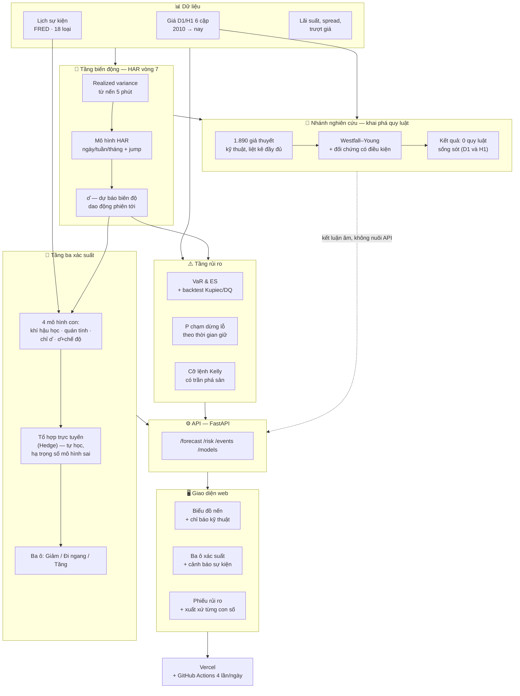

# FX-DSS — Hệ hỗ trợ quyết định giao dịch ngoại hối

**Trang chạy thật:** https://fx-dss.vercel.app
**Luận văn MIS.** Repo này chứa dữ liệu đã xử lý, toàn bộ mã, và nhật ký đầy đủ
mọi thí nghiệm — kể cả những cái thất bại.

---

## 1. Tóm tắt cho người không đọc code

Hệ thống lấy dữ liệu giá của 6 cặp ngoại hối chính (EUR/USD, GBP/USD, USD/JPY,
AUD/USD, USD/CAD, USD/CHF) từ 2010 đến nay, rồi mỗi ngày trả lời ba câu hỏi cho
nhà đầu tư:

1. **Phiên tới giá sẽ động mạnh hay yên ắng?** — đây là câu **có** trả lời
   đáng tin, đo được bằng số.
2. **Phiên tới giá sẽ tăng hay giảm?** — đã kiểm bằng nhiều phương pháp độc
   lập, và câu trả lời trung thực là: **không đoán được**, ít nhất là bằng các
   công cụ đã thử trên dữ liệu này.
3. **Nếu vào lệnh thì rủi ro bao nhiêu?** — trả lời bằng cỡ lệnh khuyến nghị,
   khoảng dừng lỗ, và ước tính lỗ tối đa trong ngày xấu (VaR/ES).

Giao diện có hai chế độ: **"Nhà đầu tư"** (mặc định, không thuật ngữ, đọc xong
là biết nên làm gì) và **"Phân tích"** (đầy đủ chỉ số kỹ thuật, cho ai muốn xem
tận gốc con số ra từ đâu).

Điều quan trọng nhất về triết lý dự án: **mọi con số trên giao diện đều phải
truy được về một phép đo cụ thể**, và **kết quả âm được báo cáo đầy đủ như kết
quả dương** — nếu một phương pháp không mang lại gì, giao diện nói thẳng điều
đó thay vì giấu đi.

---

## 2. Sơ đồ hệ thống



**Đọc sơ đồ này thế nào:** dữ liệu chảy vào hai tầng chính — **tầng biến động**
(cho ra σ̂, đã chứng minh có tín hiệu thật) và **tầng rủi ro** (VaR/ES, cỡ
lệnh). Ba ô xác suất được tính từ σ̂ cộng với lịch sự kiện. **Nhánh khai phá quy
luật** chạy song song để trả lời câu "có chỉ báo kỹ thuật nào giúp đoán hướng
không" — nó **không nuôi API sản xuất**, vì kết luận của nó là "không có gì cả"
(xem mục 4).

---

## 3. Phương pháp — bằng ngôn ngữ đơn giản

| Câu hỏi | Phương pháp | Vì sao chọn cách này |
|---|---|---|
| Phiên tới giá động mạnh cỡ nào? | **HAR vòng 7** trên realized variance (dữ liệu 5 phút) | Mô hình kinh điển trong tài chính lượng, thắng cả các mạng nơ-ron hiện đại đã thử (đo trong `docs/ML_DL_VONG7.md`) |
| Kết hợp nhiều mô hình xác suất thế nào? | **Tổ hợp trực tuyến (thuật toán Hedge)** | Trọng số tự hạ với mô hình vừa đoán sai — đúng nghĩa "học từ bài học trước", không cần huấn luyện lại từ đầu |
| Ngày họp ngân hàng trung ương / NFP / CPI ảnh hưởng thế nào? | Đo **tỷ lệ biến động thật** so với ngày thường, kèm khoảng tin cậy | Không dùng nhãn "tác động cao/thấp" theo quy ước như các lịch kinh tế khác — chỉ tin số đã đo |
| Cỡ lệnh bao nhiêu là an toàn? | **Kelly có trần phá sản**, điều chỉnh theo biến động và sụt giảm | Không dùng dự báo hướng làm lợi thế — chỉ dùng carry (chênh lệch lãi suất) đo được thật |
| Lỗ tối đa ngày xấu là bao nhiêu? | **VaR / ES** với backtest Kupiec, Christoffersen, DQ | Ba phép kiểm định thống kê chuẩn để biết con số có đáng tin không, không chỉ đưa ra suông |
| Có chỉ báo kỹ thuật nào giúp đoán hướng không? | **Khai phá quy luật có kiểm định bội** (Westfall–Young), đối chứng có điều kiện, thử cả ở D1 và H1 (592.343 quan sát) | Tránh "thấy quy luật giả" — hiện tượng rất phổ biến khi thử hàng nghìn giả thuyết mà không hiệu chỉnh |
| Nhiều cặp tiền có ảnh hưởng lẫn nhau không? | **Lan truyền biến động Diebold-Yilmaz** (phân rã phương sai từ VAR) | Phương pháp kinh tế lượng chuẩn cho câu hỏi "biến động của cặp này có phải nguyên nhân của cặp kia" |

---

## 4. Kết quả — nói thẳng, không tô hồng

### Có thật, nhưng nhỏ

Ô giữa (đi ngang), đo **ngoài mẫu** — tức trên dữ liệu chưa từng dùng để chọn
mô hình:

| tầm hạn | BSS (so với đoán theo tần suất lịch sử) | Khoảng tin cậy 95% |
|---|---|---|
| 1 phiên | **+0,0152** | [+0,0103; +0,0209] — có ý nghĩa |
| 5 phiên | **+0,0074** | [+0,0009; +0,0144] — có ý nghĩa |
| 20 phiên | −0,0058 | [−0,0193; +0,0166] — chưa chứng minh được |

Đọc là: hệ thống nhỉnh hơn "cứ đoán theo tần suất lịch sử" khoảng 1,5% ở tầm
hạn 1 phiên. Có thật, nhưng **không phải một lợi thế lớn**.

### Đã đo và xác nhận là KHÔNG có

Dự báo **hướng giá** (tăng/giảm) không có tín hiệu — xác nhận độc lập bằng
5 phương pháp khác nhau:

- Momentum: Sharpe −0,16 · Carry: Sharpe −0,05
- AUC hướng: 0,46–0,53 (không phân biệt được với việc tung đồng xu)
- Khai phá quy luật: 1.890 giả thuyết kỹ thuật, thử ở cả D1 (21.596 quan sát)
  và H1 (592.343 quan sát) — **0 quy luật sống sót** sau kiểm định bội
- Phản ứng quanh sự kiện: 18 loại (NFP, CPI, GDP, họp NHTW…) — **0/18** có
  thiên lệch hướng có ý nghĩa
- Lan truyền biến động chéo cặp (Diebold-Yilmaz): thử ở cả D1 và H1, không cải
  thiện dự báo, thậm chí tệ hơn ở H1 (`docs/KETQUA_VONG7.md`)

### Trong quá trình thử, đã bắt được và sửa các lỗi thống kê thật

Đáng nói vì đây chính là kỷ luật giúp kết quả đáng tin: một lần biến kiểm soát
đặt sai dạng làm hệ số hồi quy phóng đại giả (t = 31,7 từ một quan hệ vô nghĩa
về mặt logic), một lần lỗi định tuyến tham số làm 9 dòng kết quả tính sai. Cả
hai đều được phát hiện, sửa, và ghi lại công khai trong `docs/`.

### Rủi ro — 4/6 cặp đạt, 2/6 chưa

Backtest VaR/ES (Kupiec + Christoffersen + DQ) ở mức 99%: EURUSD, GBPUSD,
AUDUSD, USDCAD đạt cả ba. **USDJPY và USDCHF chưa đạt** — đã thử vá 2 lần,
thất bại, nguyên nhân xác định là đuôi phân phối có cấu trúc động mà mô hình
hiện tại (ước lượng vô điều kiện) chưa bắt được.

### Toàn mạch — không phải máy in tiền

Backtest ~26 năm: vốn cuối kỳ **1,004–1,037 lần** vốn ban đầu, không cấu hình
nào cháy tài khoản. Gần như hoà vốn. Đây là hệ **hỗ trợ quyết định trung thực**,
không phải hệ thống kiếm lời.

---

## 5. Cấu trúc repo

```
fx-dss/
├── data/               dữ liệu đã xử lý (giá, sự kiện, lãi suất, spread…)
├── src/                mã tính toán cốt lõi
│   ├── volfc2.py          HAR vòng 7 — dự báo σ̂ (tầng biến động)
│   ├── balop.py           ba mô hình xác suất + tổ hợp trực tuyến (Hedge)
│   ├── position_sizing.py định cỡ vị thế Kelly có trần
│   ├── sukien_profile.py  đo phản ứng giá quanh sự kiện
│   ├── run_quyluat.py     phễu khai phá quy luật ở D1
│   ├── quyluat_h1.py      phễu khai phá quy luật ở H1 (592k quan sát)
│   ├── kiem_pheu.py       kiểm chứng độ nhạy của phễu (đối chứng âm/dương)
│   ├── spillover_dy.py    lan truyền biến động Diebold-Yilmaz giữa các cặp
│   ├── va_duoi.py         thử vá đuôi phân phối USDJPY/USDCHF
│   ├── hieuchuan_lai.py   thử hiệu chuẩn lại xác suất (isotonic/nhiệt độ)
│   ├── metrics.py         VaR/ES, Kupiec, Christoffersen, DQ, MCS…
│   └── split.py           chia huấn luyện/kiểm định/kiểm tra — chống rò rỉ
├── api/main.py         FastAPI — mọi endpoint phục vụ giao diện
├── web/                giao diện: HTML/CSS/JS thuần + Lightweight Charts
├── collect/            thu thập dữ liệu (giá, sự kiện FRED, lãi suất)
├── jobs/cap_nhat.py    việc định kỳ: tải giá, tính lại, ghi sổ dự báo
├── docs/               MỌI thí nghiệm, kết quả, kể cả thất bại — xem mục 6
└── .github/workflows/  tự động cập nhật 4 lần/ngày + triển khai Vercel
```

## 6. Tài liệu chi tiết — nếu cần đào sâu

| Muốn biết gì | Đọc file nào |
|---|---|
| Toàn bộ kế hoạch nghiên cứu, đã duyệt | `docs/REPLAN_2026.md` |
| Kết quả tầng biến động (HAR vòng 7 vs ML/DL) | `docs/ML_DL_VONG7.md`, `docs/KETQUA_VONG7.md` |
| Kết quả khai phá quy luật, đủ cả D1 và H1 | `docs/GIAIDOAN2_QUYLUAT.md` |
| Backtest VaR/ES chi tiết từng cặp | `docs/CHISO_DANHGIA.md` |
| Việc còn phải làm, xếp theo ưu tiên | `docs/KEHOACH_2026Q4.md` |
| Quy tắc niêm phong dữ liệu (rất quan trọng, đọc trước khi chạy) | `docs/KHOA_SO.md` |
| Giải thích UI theo lối nói chuyện, dùng để báo cáo | `docs/BAOCAO_UI.md` |

## 7. Chạy thử

```bash
git clone <repo> && cd fx-dss
pip install numpy pandas scipy statsmodels requests fastapi "uvicorn[standard]"

# tự kiểm các module cốt lõi
python src/balop.py
python src/split.py

# chạy API + giao diện tại chỗ
python -m uvicorn api.main:app --port 8899
python web/build.py
```

Triển khai thật chạy tự động qua GitHub Actions 4 lần/ngày (`.github/workflows/capnhat.yml`) —
tải giá mới, cập nhật lịch sự kiện, ghi sổ dự báo, dựng lại và đẩy lên Vercel.

## 8. Ba điều phải biết trước khi động vào dữ liệu

1. **Đọc `docs/KHOA_SO.md` trước.** Có một tập dữ liệu bị niêm phong (6 cặp
   tiền chéo + toàn bộ 2026) để giữ tính ngoài mẫu cho lần chấm điểm cuối
   cùng. Mở sớm là mất vĩnh viễn giá trị kiểm chứng của nó.
2. **Sổ dự báo (`data/so_dubao/`) chỉ được thêm, không được sửa.** Đây là bằng
   chứng sống — mỗi dự báo được ghi trước khi biết kết quả, rồi chấm điểm sau.
3. **Mọi con số trên giao diện phải truy được về một phép đo trong `docs/`.**
   Không thêm chỉ số nào chỉ vì "nhìn có vẻ hợp lý" — nếu chưa đo, đừng hiển thị.
