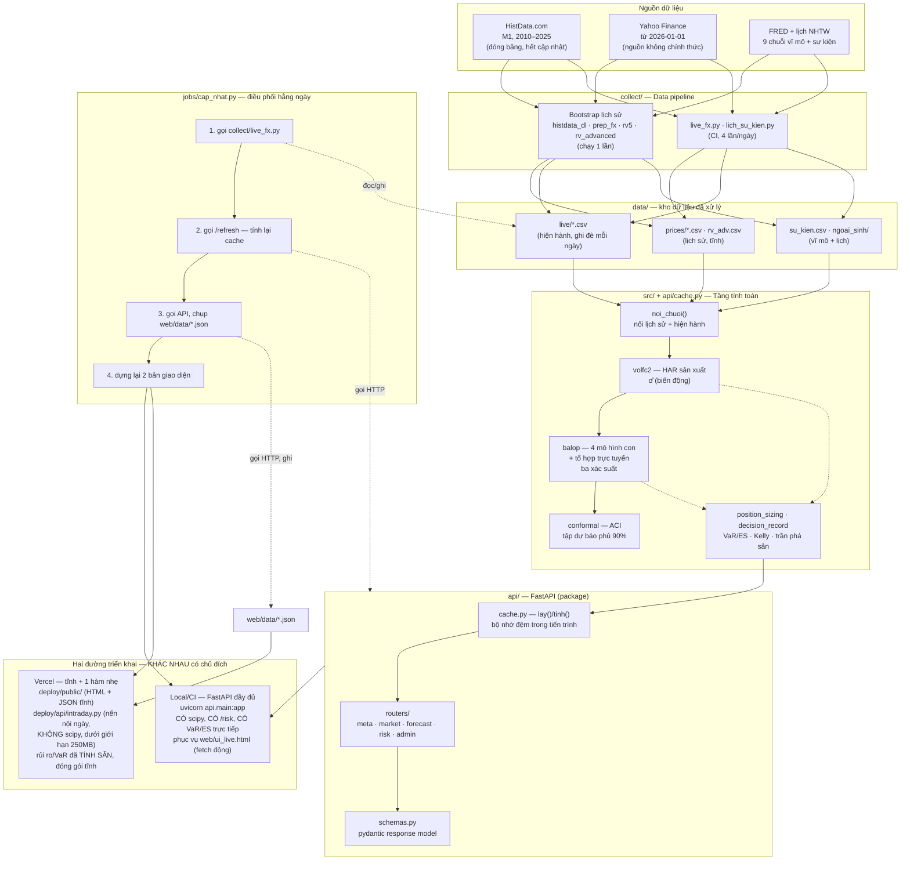

# KIẾN TRÚC HỆ THỐNG — data pipeline, tầng tính toán, API, triển khai Web

*Lập 14/09/2026. Nhánh `replan-2026`. Viết để lấp khoảng trống hội đồng nêu:
đề cương thiếu mô tả kiến trúc phần mềm, data pipeline, và cách triển khai
API/Web App — và để trả lời câu hỏi "sự liên kết giữa các module là gì".*

---

## 1. Sơ đồ tổng thể — 5 tầng, 2 đường triển khai



---

## 2. Vì sao HAI đường triển khai khác nhau — quyết định kiến trúc, không phải sơ suất

Đây chính là câu trả lời cho "sự liên kết giữa 2 module là gì" ở cấp độ
triển khai: hệ thống có **một** tầng tính toán (`api/`) nhưng **hai** cách
đưa nó tới người dùng, vì ràng buộc kỹ thuật thật:

- **Local/CI**: FastAPI đầy đủ, nạp `scipy`, `pandas`, toàn bộ lịch sử
  (~36 MB CSV) để tính `noi_chuoi → HAR → ba xác suất → ACI → VaR/ES` theo
  yêu cầu. Đây là nơi DUY NHẤT các con số rủi ro được TÍNH.
- **Vercel serverless**: giới hạn gói hàm ~250 MB đã giải nén; riêng
  `pandas+scipy+numpy` đã hơn 120 MB, cộng lịch sử CSV thì vượt giới hạn.
  Giải pháp: **tách làm hai**
  1. Dự báo (σ̂, ba xác suất, VaR/ES) — mô hình NGÀY, chỉ đổi 1 lần/ngày —
     tính SẴN ở bước `jobs/cap_nhat.py` bước 3, đóng gói thành
     `web/data/*.json` tĩnh, copy nguyên khối vào `deploy/public/data/`.
  2. Nến nội ngày (chỉ để vẽ biểu đồ, không cần scipy) — tính LÚC CÓ REQUEST
     bởi `deploy/api/intraday.py`, một hàm serverless nhẹ chỉ cần
     `requests+pandas+numpy`.

`web/ui_template.html` là NGUỒN SỰ THẬT DUY NHẤT cho giao diện — biên dịch
thành 3 bản khác nhau (`ui_live.html`, `ui.html`, `deploy/public/index.html`)
bằng phép thay thế `__DATA__`/`__API__`, không phải ba bản viết tay riêng
biệt (xem `web/build.py`, `deploy/build.py`).

---

## 3. Hợp đồng giữa các tầng (module contract)

| từ tầng | sang tầng | qua gì | định dạng |
|---|---|---|---|
| `collect/*.py` | `data/` | ghi file CSV/JSON trực tiếp | CSV theo cột đã chốt, không đổi schema ngầm |
| `data/` | `api/cache.py:noi_chuoi()` | đọc CSV theo đường dẫn cố định | DataFrame `Date, open, high, low, close, rv5, ...` |
| `src/*.py` (volfc2, balop, conformal, position_sizing) | `api/cache.py` | gọi hàm Python trực tiếp (cùng tiến trình) | mảng numpy/DataFrame, không qua serialize |
| `api/cache.py` | `api/routers/*.py` | gọi hàm `lay(pair)` → dict trong bộ nhớ | dict Python (`pan`, `xs`, `sig`, `che_do`...) |
| `api/routers/*.py` | client (Web UI / script) | HTTP JSON, một phần có `pydantic response_model` | JSON, xem `api/schemas.py` |
| `jobs/cap_nhat.py` | `web/data/*.json` | gọi API qua HTTP (KHÔNG tính lại bằng đường khác) | JSON tĩnh, y hệt API trả về |
| `web/data/*.json` | `deploy/public/data/` | copy nguyên khối (`shutil.copytree`) | không biến đổi |

Nguyên tắc xuyên suốt: **API là nguồn sự thật duy nhất**. `jobs/cap_nhat.py`
không bao giờ tính lại bằng công thức khác — nó GỌI API rồi chụp lại kết
quả, để bản tĩnh (Vercel) và bản trực tiếp (local) không bao giờ lệch nhau
vì hai đường tính khác nhau.

---

## 4. Tầng kiểm-sốc giữa phiên (thêm 14/09/2026)

*Trả lời câu hỏi "hệ thống có tái phân tích liên tục theo thời gian thực
không" — không, và đây là lý do có chủ đích cộng với bản vá đã thêm.*

**Vì sao KHÔNG chạy liên tục theo nghĩa "dự báo lại mỗi giây".** Toàn bộ
dự án đã chứng minh kỹ năng dự báo chỉ tồn tại ở tầm **NGÀY** — hạ phễu
xuống H1 vẫn 0 quy luật sống sót. Chạy lại mô hình liên tục sẽ không
"khai phá thêm" được gì; nó chỉ có nghĩa nếu dùng để phát hiện khi nào
**giả định của dự báo hôm nay đã bị vi phạm**, rồi tái kích hoạt ĐÚNG mô
hình ngày đã có, sớm hơn lịch — không phải một mô hình dự báo mới.

**Cơ chế** (`collect/kiem_soc.py`, workflow `.github/workflows/kiemsoc.yml`):

```
mỗi 15 phút → gọi TrueFX lấy giá hiện tại (không cần đăng ký/khoá)
            → so với giá đã dùng để tính dự báo hôm nay (`/forecast`)
            → z = log(giá_hiện_tại / giá_mốc) / σ̂_hôm_nay
            → |z| > 1,5  → tái chạy TOÀN BỘ pipeline sản xuất hiện có NGAY
                            (không chờ lịch cron 4 lần/ngày)
            → |z| ≤ 1,5  → không làm gì, chờ lượt kiểm tiếp theo
```

Hai job GitHub Actions riêng (`kiemtra` rẻ, `taitinh` chỉ chạy khi có sốc)
để không tốn CPU CI/dữ liệu bên ngoài một cách vô ích. Chung nhóm
concurrency `capnhat` với `capnhat.yml` để không bao giờ chạy chồng lên
việc tải/commit/triển khai.

**Vì sao TrueFX, không phải Yahoo hay Twelve Data.** Đã đo trực tiếp:
Yahoo interval=1m là ảnh chụp giá (98,7% thanh o=h=l=c, không phải OHLC
thật). Twelve Data cho nến M1 sạch nhưng cần khoá + giới hạn 800
credit/ngày (ép tần suất kiểm tối đa ~15 phút/lần với 6 cặp). TrueFX cho
giá bid/ask thời gian thực, không cần đăng ký, không thấy giới hạn rõ
ràng (đã thử 5 lần gọi liên tiếp, đều HTTP 200) — hợp cho việc CHỈ cần
giá hiện tại, không cần nến dựng sẵn. Dukascopy đã thử, hạ tầng
`datafeed.dukascopy.com` hiện không phản hồi ổn định (503/504/timeout,
đo trực tiếp 14/09/2026) — không dùng được, dù đây mới là nguồn "chính
thức" nhất về mặt lý thuyết.

**Sửa kèm khi xây tầng này**: phát hiện lỗi lệch giá trong `/forecast` và
`/forecast_series` — xem mục 6.

## 4b. Rào chắn RV5 thật (thêm 15/09/2026)

*Trả lời câu hỏi "có nên lấy nến trực tiếp từ TradingView / các sàn để hệ thống
tái phân tích liên tục không" — và vá một lỗi âm thầm phát hiện khi trả lời.*

**Vì sao không đổi sang feed liên tục.** Mục 4 đã nói: kỹ năng dự báo chỉ tồn
tại ở tầm ngày, hạ phễu xuống H1 với 592.343 thanh vẫn 0 quy luật. Dữ liệu dày
hơn không mua thêm kỹ năng dự báo. TradingView ngoài ra không có đường hợp lệ —
không mở API dữ liệu, dữ liệu là mua lại nên không có quyền phát tán tiếp, và
điều khoản cấm cào; quan trọng hơn với luận văn là **không khai được nguồn gốc**,
thứ mà cả `KHOA_SO.md` dựng lên trên đó.

**Nhưng có một khiếm khuyết thật mà dữ liệu tốt hơn sẽ vá.** HAR cần phương sai
thực hiện 5 phút. Yahoo chỉ phục vụ thanh 5 phút trong ~60 ngày; ngoài cửa sổ đó
`live_fx.py` **ước** rv5 từ thanh giờ (`rv_uoc=1`). Đo ngày 15/09/2026:

| cửa sổ | vai trò | nhiễm RV ước |
|---|---|---|
| `lm` = 22 phiên | vào **thẳng** ma trận thiết kế cả ba mô hình con | **0/22 — sạch** |
| `WIN_Z` = 250 phiên | chỉ chuẩn hoá biến chế độ `G = sigmoid(z)` | **120/250 = 48%** |

Nên câu trong docstring `live_fx.py` — "RV ước không nuôi dự báo" — **không
chính xác**: nó có nuôi, qua đường `WIN_Z`. Đã đính chính tại chỗ. Hệ quả thì
không đáng kể, đã đo bằng độ nhạy: nhiễu rv5 các hàng ước đi **±20%** chỉ làm
σ̂ hôm nay đổi **tối đa 0,10%** trên cả 6/6 cặp — z-score qua sigmoid nuốt gần
hết sai số.

**Chỗ nguy hiểm thật là khi số phiên RV5 thật *liên tiếp* tụt xuống dưới 22**:
lúc đó `lm` vào thẳng hồi quy, không có z-score che. Trước 15/09/2026 con số này
được **hiển thị** (`/health`, cờ `rv_uoc` trên giao diện) nhưng **không có một
assert nào** — nguồn 5 phút ngừng phục vụ thì mọi thứ vẫn chạy, vẫn ra số, chỉ
là số lệch và không ai biết.

Rào chắn (`api/cache.py::kiem_rv_that`, `collect/live_fx.py`):

```
< 22 phiên thật liên tiếp  → CHẶN CỨNG, /forecast trả 503, không phục vụ dự báo
22 .. 36                   → cảnh báo, vẫn phục vụ, banner vàng trên giao diện
>= 37                      → lành
```

Đại lượng quyết định là số phiên thật **liên tiếp tính từ cuối**, không phải
tổng: một khoảng ước chèn sát cuối vẫn cắt cửa sổ 22 dù tổng rất lớn.

Trạng thái tại 15/09/2026: **59 phiên liên tiếp, đệm 37** — không chặn, không
cảnh báo. Rào chắn không đổi hành vi nào hiện tại; nó chỉ đảm bảo lần hỏng sau
là hỏng **ồn ào** thay vì âm thầm.

Nếu về sau muốn bỏ hẳn vách 60 ngày này thì đường đúng là broker có hợp đồng
(OANDA v20, Saxo, IG) hoặc Dukascopy `.bi5` — chứ không phải để chạy lại mô
hình mỗi giây.

## 5. Việc đã dọn trong lần rà soát này

- Tách `api/main.py` (928 dòng monolithic) thành package `config/cache/
  utils/risk_logic/schemas + routers/*` — xem git log nhánh này.
- Xoá scaffold Next.js (`web/pages`, `web/api/*.py`) — đã bị chính kế hoạch
  `docs/REPLAN_2026.md` thay thế bằng kiến trúc ở tài liệu này nhưng chưa
  được dọn khỏi repo.
- `src/pipeline.py` — phát hiện đây là code thử nghiệm sớm (29/08/2026),
  đường dẫn cứng `/tmp/fx/` không khớp bố cục repo hiện tại, không được
  import ở bất kỳ đâu. Không xoá trong lần rà soát này (chưa được yêu cầu)
  nhưng cần lưu ý: đây là code chết, không phải một phần pipeline đang chạy.

## 6. Lỗi lệch giá trong `/forecast`/`/forecast_series` — sửa 14/09/2026

**Phát hiện khi nào**: lúc xây tầng kiểm-sốc (mục 4), do script kiểm-sốc
cần đọc trường `gia` từ `/forecast` — trường đó trước đây **không tồn
tại**, và khi thêm vào thì giá trị trả về sai lệch nghiêm trọng.

**Lỗi**: `api/routers/forecast.py` dùng chỉ số `i` tính từ `_idx(K, ngay)`
(hợp lệ cho `K["pan"]`, panel nghiên cứu bắt đầu 2012-02-14) để đọc thẳng
vào `K["m"]` (giá thô, đủ từ 2010-01-04) — hai mảng lệch nhau **552
dòng**. Kết quả: chỉ số "mới nhất" của `pan` (2026-09-11) khi áp vào `m`
lại trỏ tới ngày **2024-07-24** — lệch hơn 2 năm, không báo lỗi vì cả hai
chỉ số đều "hợp lệ" về mặt kỹ thuật.

**Đo được ảnh hưởng thật** (giá dùng để quy đổi `sigma_pip`/`dai_pip` từ
đơn vị tương đối sang pip, qua `sang_pip()`):

| Cặp | Lệch |
|---|---|
| EURUSD | −6,59% |
| GBPUSD | −4,64% |
| USDJPY | +0,10% |
| AUDUSD | −8,36% |
| USDCAD | −0,41% |
| USDCHF | +8,46% |

**Sửa**: thêm `api/cache.py::gia_theo_ngay()` — tra `K["m"]` theo NGÀY
thật (`np.searchsorted` trên `K["m"].Date.values`), không dùng chung chỉ
số với `pan`. Áp dụng ở cả hai điểm gọi (`/forecast`, `/forecast_series`).
`/risk` không bị ảnh hưởng vì nó dùng `m.close.values[-1]` (chỉ số `-1`
đúng cho cả hai mảng vì chúng kết thúc cùng một ngày).

**Không ảnh hưởng kết quả nghiên cứu đã đóng băng** — đã xác minh bằng
grep toàn bộ `src/`: không script backtest/nghiên cứu nào gọi qua API
`/forecast`, chúng tính trực tiếp qua `src/volfc2.py` và các module khác.
Lỗi chỉ nằm ở tầng hiển thị/phục vụ API, không lan vào số liệu đã báo cáo
trong luận văn.
