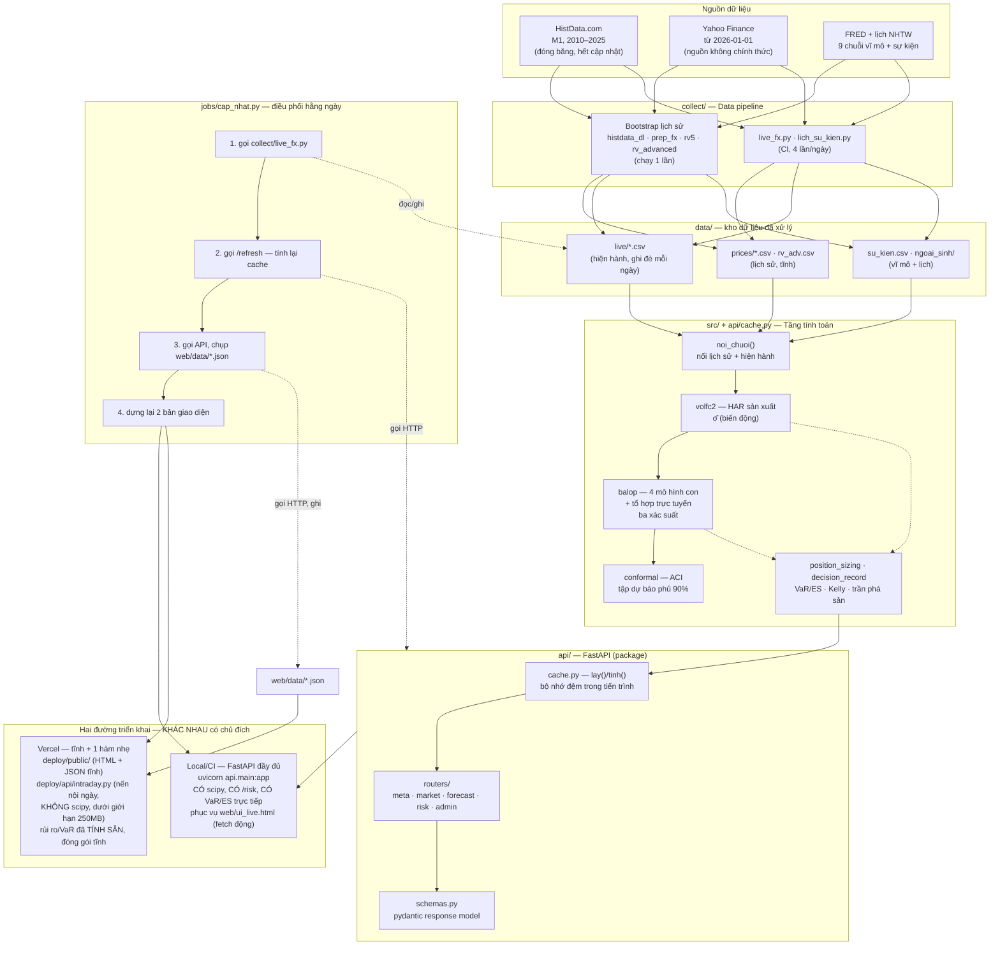

# KIẾN TRÚC HỆ THỐNG — data pipeline, tầng tính toán, API, triển khai Web

*Lập 14/09/2026. Nhánh `replan-2026`. Viết để lấp khoảng trống hội đồng nêu:
đề cương thiếu mô tả kiến trúc phần mềm, data pipeline, và cách triển khai
API/Web App — và để trả lời câu hỏi "sự liên kết giữa các module là gì".*

---

## 1. Sơ đồ tổng thể — 5 tầng, 2 đường triển khai

---

## 2. Vì sao HAI đường triển khai khác nhau — quyết định kiến trúc, không phải sơ suất

Đây chính là câu trả lời cho "sự liên kết giữa 2 module là gì" ở cấp độ
triển khai: hệ thống có **một** tầng tính toán (`api/`) nhưng **hai** cách
đưa nó tới người dùng, vì ràng buộc kỹ thuật thật:

- **Local/CI**: FastAPI đầy đủ, nạp `scipy`, `pandas`, toàn bộ lịch sử
  (~36 MB CSV) để tính `noi_chuoi → HAR → ba xác suất → ACI → VaR/ES` theo
  yêu cầu. Đây là nơi DUY NHẤT các con số rủi ro được TÍNH.
- **Vercel serverless**: giới hạn gói hàm ~250 MB đã giải nén; riêng
  `pandas+scipy+numpy` đã hơn 120 MB, cộng lịch sử CSV thì vượt giới hạn.
  Giải pháp: **tách làm hai**
  1. Dự báo (σ̂, ba xác suất, VaR/ES) — mô hình NGÀY, chỉ đổi 1 lần/ngày —
     tính SẴN ở bước `jobs/cap_nhat.py` bước 3, đóng gói thành
     `web/data/*.json` tĩnh, copy nguyên khối vào `deploy/public/data/`.
  2. Nến nội ngày (chỉ để vẽ biểu đồ, không cần scipy) — tính LÚC CÓ REQUEST
     bởi `deploy/api/intraday.py`, một hàm serverless nhẹ chỉ cần
     `requests+pandas+numpy`.

`web/ui_template.html` là NGUỒN SỰ THẬT DUY NHẤT cho giao diện — biên dịch
thành 3 bản khác nhau (`ui_live.html`, `ui.html`, `deploy/public/index.html`)
bằng phép thay thế `__DATA__`/`__API__`, không phải ba bản viết tay riêng
biệt (xem `web/build.py`, `deploy/build.py`).

---

## 3. Hợp đồng giữa các tầng (module contract)

| từ tầng | sang tầng | qua gì | định dạng |
|---|---|---|---|
| `collect/*.py` | `data/` | ghi file CSV/JSON trực tiếp | CSV theo cột đã chốt, không đổi schema ngầm |
| `data/` | `api/cache.py:noi_chuoi()` | đọc CSV theo đường dẫn cố định | DataFrame `Date, open, high, low, close, rv5, ...` |
| `src/*.py` (volfc2, balop, conformal, position_sizing) | `api/cache.py` | gọi hàm Python trực tiếp (cùng tiến trình) | mảng numpy/DataFrame, không qua serialize |
| `api/cache.py` | `api/routers/*.py` | gọi hàm `lay(pair)` → dict trong bộ nhớ | dict Python (`pan`, `xs`, `sig`, `che_do`...) |
| `api/routers/*.py` | client (Web UI / script) | HTTP JSON, một phần có `pydantic response_model` | JSON, xem `api/schemas.py` |
| `jobs/cap_nhat.py` | `web/data/*.json` | gọi API qua HTTP (KHÔNG tính lại bằng đường khác) | JSON tĩnh, y hệt API trả về |
| `web/data/*.json` | `deploy/public/data/` | copy nguyên khối (`shutil.copytree`) | không biến đổi |

Nguyên tắc xuyên suốt: **API là nguồn sự thật duy nhất**. `jobs/cap_nhat.py`
không bao giờ tính lại bằng công thức khác — nó GỌI API rồi chụp lại kết
quả, để bản tĩnh (Vercel) và bản trực tiếp (local) không bao giờ lệch nhau
vì hai đường tính khác nhau.

---

## 4. Việc đã dọn trong lần rà soát này

- Tách `api/main.py` (928 dòng monolithic) thành package `config/cache/
  utils/risk_logic/schemas + routers/*` — xem git log nhánh này.
- Xoá scaffold Next.js (`web/pages`, `web/api/*.py`) — đã bị chính kế hoạch
  `docs/REPLAN_2026.md` thay thế bằng kiến trúc ở tài liệu này nhưng chưa
  được dọn khỏi repo.
- `src/pipeline.py` — phát hiện đây là code thử nghiệm sớm (29/08/2026),
  đường dẫn cứng `/tmp/fx/` không khớp bố cục repo hiện tại, không được
  import ở bất kỳ đâu. Không xoá trong lần rà soát này (chưa được yêu cầu)
  nhưng cần lưu ý: đây là code chết, không phải một phần pipeline đang chạy.
