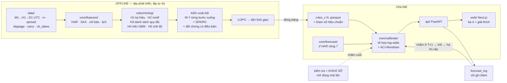

# Kế hoạch lại 2026 — hệ khai phá quy luật xuyên bộ dữ liệu

*Lập 03/09/2026 theo `docs/PROMPT_REPLAN_EN.md`.
**Trạng thái: đã duyệt 03/09/2026. Giai đoạn 0 ĐÃ CHẠY XONG — xem
`docs/GIAIDOAN0_KETQUA.md`.**
Vẫn chưa viết một dòng mã sản xuất nào (giai đoạn 0 chỉ chạy mã đã có sẵn). Mọi con số trong tài liệu này đều đã được
kiểm chứng lại từ repo — nguồn ghi ngay cạnh số.*

---

## 0. Phạm vi phiên này

Spec yêu cầu ba thứ: (a) tự đọc repo, không tin bản tóm tắt trong spec;
(b) viết tài liệu kế hoạch này; (c) không xây gì cho tới khi được duyệt.
Mục 1 dưới đây là kết quả của (a) — và nó **đã tìm ra hai chỗ spec ghi chưa
khớp với repo**, cùng ba thứ repo đã có mà spec không biết.

---

## 1. Kiểm chứng repo — spec nói gì, repo nói gì

### 1.1 Bảy ràng buộc âm trong spec

| # | Spec nói | Kiểm chứng | Nguồn trong repo |
|---|---|---|---|
| 1 | Hướng đi không dự báo được ở tầm ngày; E[z_T] ≈ 0 | **ĐÚNG** | `TANG6B_DUNGTOIUU.md:60`, `TANG6_HIEU_CHUAN.md:96`, `decision_record.py:39,64` |
| 2 | Biến động dự báo được, là tài sản mạnh nhất | **ĐÚNG** | QLIKE kiểm tra 0,1585 so 0,2172 của nền cũ (−27,0%); DM 6/6; MCS α=0,10 chỉ còn HAR v7 — `KETQUA_VONG7.md` |
| 3 | 4.722 ứng viên → **3** mẫu sống sót, cả 3 là mẫu biến động, **0** mẫu hướng | **ĐÃ LỖI THỜI — repo đi xa hơn** | xem 1.2 |
| 4 | RL thất bại: PPO 0,018 · CVaR-PPO 0,030 so 0,800 quy tắc tay; bandit 0,144 nhưng vẫn thua | **ĐÚNG** | `SIZING_COMPARISON.md:148,156,164` — lưu ý quy tắc tay có **hai** số đo trên hai lưới sụt giảm khác nhau: 0,800 (dd 0/10/30) và 0,886 (dd 0/5/10/20/30) |
| 5 | Fuzzy không thêm gì (+0,08%, trong nhiễu hạt giống) | **ĐÚNG** | `SIZING_COMPARISON.md` |
| 6 | Momentum trong chế độ biến động cao lỗ có ý nghĩa: Sharpe −0,62, p=0,001, qua Bonferroni | **KHÔNG KIỂM CHỨNG ĐƯỢC** | xem 1.3 |
| 7 | Conformal phủ thiếu khi đang lỗ (~89,3% so 90,3% ở đỉnh vốn) | **ĐÚNG, số khớp chính xác** | `TANG6_HIEU_CHUAN.md:65–72`. Kèm: Gauss 89,7→88,6; Student-t 88,8→87,8 |

### 1.2 Ràng buộc #3 đã lỗi thời, và tin mới **tốt hơn** cho luận văn

`docs/KETQUA_VONG7.md` mục 9 (việc 4) đã bịt lỗ hổng kiểm định bội cho nhánh ký
hiệu — sau khi spec được viết. Con số hiện hành:

- **Liệt kê toàn bộ không gian**: W ∈ {2,3,4} trạng thái tiền đề × 3 đích = **351
  giả thuyết**, 336 đủ số khớp. (Con số 4.722 trong spec là của nhánh HuyH trên
  FRED daily, không phải của nhánh này.)
- **Ba mô hình null** (SPEck, Jenkins et al. 2022), ngưỡng max|z| 95%:

  | null | ý nghĩa | ngưỡng |
  |---|---|---|
  | xoay chuỗi đích | "không gì dự báo được" | 11,51 |
  | **khối 2 ngày** | **"đã chứa sẵn tính dai AR(1)"** | **29,51** |
  | khối 5 ngày | "đã chứa sẵn tính dai một tuần" | 53,41 |
  | không hiệu chỉnh bội | — | 1,96 |

- **Số sống sót trong 336**: 248 nếu không hiệu chỉnh (nếu toàn nhiễu thì kỳ vọng
  17) · 262 FDR-BH · 158 W-Y null xoay · **41 W-Y null khối 2 ngày** · 20 null
  khối 5 ngày. **Hệ số thổi phồng 6 lần.**
- **Đối chứng có điều kiện với chính dự báo HAR** — `1{đích} = a + b·1{khớp} +
  c·log(HAR)`:

  | mẫu | b chỉ mẫu | t | b khi có HAR | t | kết luận |
  |---|---|---|---|---|---|
  | MEDIUM→HIGH→HIGH ⇒ HIGH | 0,3675 | 22,6 | 0,1236 | **8,94** | còn tin riêng |
  | LOW→MEDIUM→LOW ⇒ LOW | 0,2756 | 16,9 | 0,0812 | **6,05** | còn tin riêng |
  | HIGH→HIGH→MEDIUM ⇒ HIGH | 0,1599 | 9,9 | −0,0043 | **−0,32** | bị HAR hấp thụ |

**Hệ quả cho kế hoạch — quan trọng:** tiền đề "có quy luật khai phá được" **mạnh
hơn** spec tưởng. Không phải 3 quy luật, mà **41 ứng viên biến động sống sót
kiểm soát bội đúng cách**, trong đó ít nhất 2 mang thông tin **độc lập với HAR**.
Đây là vật liệu thật cho thư viện quy luật, không phải hy vọng.

Đồng thời một cảnh báo phương pháp phải mang sang: `HIGH→HIGH⇒HIGH` có z ≈ 69 và
là **tính dai tầm thường**. Bản một-bước của Westfall–Young bị nó chiếm hết thống
kê max nên mọi giả thuyết khác không bao giờ bác bỏ được — **bắt buộc dùng bản
maxT từng bước xuống**. Bộ máy này đã cài và đã kiểm trong `src/run_sax_stats.py`.

### 1.3 Ràng buộc #6 chưa có trên hồ sơ

`src/run_momentum_regime.py` **tồn tại** và làm đúng việc đó: chia 3 chế độ theo
tercile của `sig` (dự báo HAR, nhân quả), ngưỡng chốt trên đoạn huấn luyện, ý
nghĩa thống kê bằng Diebold–Mariano với Newey-West. Nhưng:

- không tài liệu nào trong `docs/` ghi kết quả của nó,
- script **không ghi file output** nào (`grep to_csv|json.dump` → 0),
- `output/` không có tệp tương ứng,
- file còn **untracked** trong git.

> **CẬP NHẬT 03/09/2026 — đã chạy, ràng buộc #6 XÁC NHẬN.** Sharpe −0,615,
> t = −3,30, p = 0,001, n = 6.020 trên đoạn kiểm định; và âm ở **cả 12 ô**
> (4 span × 3 đoạn). Chi tiết: `docs/GIAIDOAN0_KETQUA.md` mục 2.

Nên con số "Sharpe −0,62, p=0,001, qua Bonferroni" tôi **không xác nhận được** và
sẽ **không** trình bày như kết quả đã có. Việc 1 của giai đoạn 0: chạy nó, ghi
kết quả vào `docs/`, ghi output vào `output/`. Nếu số đúng như spec thì đó là
**tín hiệu âm dùng được** (biết chỗ *không* vào lệnh có giá trị thật) và nó vào
thư viện quy luật như một quy luật loại-trừ.

### 1.4 Ba thứ repo đã có mà spec không biết

> **CẬP NHẬT 03/09/2026 — cả bốn đã chạy và có hồ sơ:**
> `docs/GIAIDOAN0_KETQUA.md`, log thô ở `output/log_*.txt`.
> Kết quả đầu bảng: `run_sax_gia.py` cho **0/351** mẫu hướng sống sót.

| Thứ | Vì sao quan trọng |
|---|---|
| **`src/run_sax_gia.py`** — SAX trên **hướng giá** (tercile lợi suất ngày), W=2,3,4, Westfall–Young từng bước xuống, null khối 2 ngày, phát hiện trên huấn luyện+kiểm định, xác nhận trên kiểm tra | **Đây chính là câu hỏi trung tâm của luận văn mới, và mã đã viết xong nhưng chưa chạy trên hồ sơ.** Nó thậm chí đã viết sẵn nhánh in ra kết luận âm. Chạy nó là hành động có giá trị cao nhất trong toàn kế hoạch |
| **`src/run_corr_regime.py`** — tương quan danh mục có sập theo chế độ biến động không | trả lời câu ρ = 0,44 có phải hằng số; ảnh hưởng trực tiếp hệ số danh mục |
| **`src/ml_data.py`** — bộ đặc trưng dùng chung cho ML/DL, **cố tình cho ML nhiều hơn HAR** (thêm 22 độ trễ thô, thứ trong tuần, mã cặp) | đúng cái spec 4.2 cần cho "trần GBM"; không phải viết lại |

`run_sax_gia.py`, `run_momentum_regime.py`, `run_corr_regime.py`, `run_pdv.py`
đều untracked và chưa có tài liệu. Giai đoạn 0 phải chạy và lập hồ sơ cho cả bốn
**trước khi** thiết kế gì mới lên trên chúng.

---

## 2. Hình thức hoá bài toán (spec 4.1)

### 2.1 Một lỗi thiết kế trong spec 4.1, và cách vá

Spec yêu cầu dải "đi ngang" phải **co giãn theo biến động**: `|r| < k·σ̂`, không
dùng ngưỡng pip cố định. Nhưng trong repo, `panel2_6pairs.csv` đã có sẵn

```
zT = log(close_t / close_{t−1}) / sig        (src/build_panel2.py:47)
```

tức `zT` **đã là** `r/σ̂`. Vậy `|r| < k·σ̂ ⟺ |zT| < k`. Và repo khớp **một** phân
phối Student-t cho `zT` mỗi cặp trên đoạn huấn luyện rồi dùng nguyên
(`compare_leverage_dp.py:66`: `stats.t.fit(pan.zT.values[tr], floc=0)`) — tức là
coi phân phối đã chuẩn hoá là **dừng**.

Nếu giả thiết đó đúng thì `P(|zT| < k)` là **hằng số theo ngày**. Ô vàng trên
giao diện sẽ hiện **cùng một con số mỗi ngày** và mang **không** thông tin. Đây
không phải chuyện nhỏ: nó vô hiệu hoá đúng cái ô mà spec nói là nơi chứa phần
lớn kỹ năng khả đạt.

**Vá: hai mục tiêu, cho hai việc khác nhau. Cả hai đều cần.**

| | **Mục tiêu R** (nghiên cứu) | **Mục tiêu P** (sản phẩm) |
|---|---|---|
| Biến đích | `zT` — lợi suất **đã chuẩn hoá** | `r` — lợi suất **thô** |
| Dải | `|zT| < k` | `|r| < b`, `b` tính bằng **pip, cố định** |
| Vì σ̂ đã bị chia ra… | mọi kỹ năng ở đây là kỹ năng **vượt trên** tầng 2 | dải cố định + σ̂ động ⟹ `P = P(|zT| < b/σ̂)` **đổi mỗi ngày** |
| Nền để so | khí hậu học trên `zT` = chính mô hình "chỉ σ̂" | khí hậu học trên `r` |
| Dùng để | **trả lời câu hỏi khoa học**: quy luật có thêm gì ngoài σ̂? | **hiển thị trên UI**: ô vàng có thông tin thật |

Điều làm hai mục tiêu ăn khớp nhau: mục tiêu P **chở đúng thông tin của tầng 2
ra màn hình**. Ngày êm σ̂ nhỏ ⟹ `b/σ̂` lớn ⟹ ô vàng cao; ngày căng thì ngược lại.
Và biên độ dao động đó chính là đại lượng tầng 2 đã chứng minh dự báo tốt: chấm
điểm phân tầng theo ngũ phân vị cho QLIKE Q5/Q1 = 1,82 ở nền cũ so **1,01** ở
HAR v7, khoảng cách giữa hai mô hình +0,0122 ở chế độ êm nhất nhưng **+0,1609**
ở chế độ căng nhất — **rộng gấp 13 lần** (`KETQUA_VONG7.md` mục 7).

Mục tiêu R là **phép thử sạch** mà spec 4.3 đòi ("nếu quy luật không thắng mô
hình chỉ-σ̂ thì phải báo cáo thẳng"): trên mục tiêu R, mô hình chỉ-σ̂ **suy biến
thành hằng số**, nên bất kỳ quy luật nào thắng nó đều chứng minh có thông tin
vượt tầng 2. Không lẫn lộn được.

### 2.2 Định nghĩa ba lớp

Với tầm hạn `h` phiên và mốc `t` (mọi thứ nhân quả, chỉ dùng thông tin ≤ t−1):

```
r_h(t)  = log(close_{t+h} / close_t)
σ̂_h(t) = σ̂(t) · √h · c_h        (c_h = hệ số hiệu chỉnh, xem 2.4)

Mục tiêu R:  giảm | zT_h < −k        đi ngang | |zT_h| ≤ k        tăng | zT_h > k
Mục tiêu P:  giảm | r_h  < −b        đi ngang | |r_h|  ≤ b        tăng | r_h  > b
```

**Chọn `k` và `b`:** `k` đặt sao cho lớp đi ngang chiếm ~1/3 trên đoạn **huấn
luyện** (≈ k = 0,43 nếu z ~ chuẩn; đo thật trên `zT` vì đuôi dày hơn chuẩn —
PIT+KS đã bác bỏ chuẩn ở p = 0,0001, `CHISO_DANHGIA.md`). `b` mặc định = trung vị
`σ̂` 12 tháng trượt của từng cặp, để lúc bình thường ba ô cân nhau. Cả hai đều
**không đặt tay**: ước lượng trên huấn luyện, đóng băng, áp sang kiểm định/kiểm
tra — đúng quy ước ngưỡng của `run_sax_stats.py` và `run_momentum_regime.py`.

**Độ nhạy bắt buộc** (spec 4.1 đòi): `k ∈ {0,25; 0,43; 0,67; 1,00}` × `h ∈ {1, 5,
20}` cho mục tiêu R; `b/trung vị σ̂ ∈ {0,5; 0,75; 1,0; 1,5}` × cùng `h` cho mục
tiêu P. Bảng đầy đủ vào phụ lục luận văn. `h = 1` là mặc định vận hành vì mọi
thứ ở tầng 2 đã hiệu chuẩn cho một phiên; `h = 5, 20` phải dùng bảng tầm hạn đã
đo, **không** dùng quy tắc √h thô — repo đã đo quy tắc √h đúng trung bình
(1,006–1,011) nhưng **lệch tới ±14% theo chế độ biến động** (`TANG6_TAMHAN.md`),
và đó chính là `c_h`.

### 2.3 Hàm mất và nền phải thắng

Hàm mất chính: **log-loss (điểm log)** trên ba lớp. Phụ: Brier nhiều lớp, và
**Brier skill score so khí hậu học** làm số báo cáo chính vì nó đọc được trực
tiếp (0 = không hơn khí hậu học).

Nền bắt buộc, xếp từ yếu tới mạnh:

| # | Nền | Vì sao có mặt |
|---|---|---|
| 1 | **khí hậu học** — tần suất lớp vô điều kiện trên huấn luyện | sàn tuyệt đối |
| 2 | **quán tính** — lớp hôm qua | bắt tính dai tầm thường |
| 3 | **chỉ-σ̂** — Student-t (hoặc conformal) trên `zT` với σ̂ của tầng 2, không mẫu nào | **nền quyết định.** Thắng được nó mới có luận văn |
| 4 | **σ̂ + tính dai** — thêm trạng thái biến động hôm qua | chặn đường "quy luật" chỉ là AR(1) đội lốt |

Ghi rõ trước: trên **mục tiêu R**, nền 3 suy biến thành nền 1. Đó là chủ ý.

### 2.4 Báo cáo phần hướng cho trung thực (spec 4.1 đòi)

Vì tách đi-ngang/không-đi-ngang là chỗ có kỹ năng còn tăng/giảm nằm sát tần suất
nền, hệ thống phải nói đúng điều đó chứ không bơm tự tin giả:

1. Cạnh ba ô, in **một thống kê kỹ năng hướng riêng** kèm khoảng tin cậy — AUC
   của `P(tăng)/(P(tăng)+P(giảm))` so dấu thực, bootstrap khối.
2. Nếu KTC 95% **phủ 0,50** thì giao diện ghi thẳng *"không phân biệt được
   hướng"* và hai ô ngoài hiển thị dạng **đối xứng quanh nền**, không hiển thị
   như hai lựa chọn cạnh tranh.
3. Phân rã in ra được: bao nhiêu phần của điểm log đến từ trục đi-ngang, bao
   nhiêu từ trục hướng. Đây là bảng trung tâm của chương kết quả.
4. Không bao giờ hiện một ô ngoài > 50% trừ khi thống kê ở (1) bác bỏ 0,50.

---

## 3. Phương pháp khai phá quy luật (spec 4.2) — phần lõi luận văn

### 3.1 Năm họ, cùng dữ liệu, cùng fold, cùng giao thức

| Họ | Cài ở đâu | Trạng thái |
|---|---|---|
| **H1 · ký hiệu / SAX tuần tự** | `rules/mining/symbolic.py`, **tái dùng** `run_sax_stats.py` (biến động) và `run_sax_gia.py` (hướng) | mã đã có; hướng **chưa chạy trên hồ sơ** |
| **H2 · motif (matrix profile)** | `rules/mining/motif.py` — cửa sổ chuẩn hoá z, độ dài 5/10/20, khoảng cách Euclid trên hình dạng | **mới** |
| **H3 · học quy tắc đọc được** | `rules/mining/rulelist.py` — CART→danh sách quy tắc, RuleFit, skope-rules, danh sách quy tắc Bayes | **mới** |
| **H4 · trần GBM + SHAP** | `rules/mining/ceiling.py` — **tái dùng** `ml_data.py` (bộ đặc trưng đã cố tình rộng hơn HAR) và `run_ml.py` (LightGBM có cả bản tối ưu QLIKE trực tiếp) | phần lớn đã có |
| **H5 · chế độ làm lớp điều kiện** | `rules/mining/regime.py` — HMM / điểm ngắt; **tái dùng** `run_corr_regime.py`, `run_momentum_regime.py` | một nửa đã có |

H4 báo cáo **làm trần trên**, không xuất xưởng làm "quy luật" — đúng như spec
yêu cầu. Lý do có cơ sở trong repo: 14 mô hình ML/DL đã chạy đúng giao thức
70/15/15 và mô hình cây thua **mọi** biến thể HAR; chỉ tổ hợp HAR v7 + GRU (+LSTM)
hơn được 1,8–2,2%, và chỉ một trong hai đạt p < 0,05 (`ML_DL_VONG7.md`).

### 3.2 Kiểm soát bội — tái dùng bộ máy đã kiểm, không viết lại

Nguy cơ số một của dự án là data snooping, và repo **đã có** phòng tuyến đúng:
Westfall–Young **maxT từng bước xuống** với **null khối 2 ngày** làm mặc định
(`run_sax_stats.py`). Kế hoạch giữ nguyên nó và thêm hai thứ spec đòi:

- **Hansen SPA** và **White Reality Check** trên chuỗi P&L / điểm log của các
  ứng viên, để phát biểu được "cả họ ứng viên không thắng nền" chứ không chỉ
  từng quy luật một.
- **FDR-BH** báo cáo song song làm số tham chiếu — nhưng **không** dùng làm cửa,
  vì trên chính dữ liệu này FDR để lọt 262/336 trong khi W-Y khối 2 chỉ để lọt 41.

Ba null phải báo cáo cả ba, và nêu rõ null nào là null quyết định cho từng mục
tiêu: **khối 2 ngày** cho biến động (đã chứa sẵn tính dai), **xoay chuỗi** cho
hướng (vì lợi suất ngày gần như không tự tương quan, null khối sẽ quá bảo thủ) —
quyết định này phải ghi vào biên bản **trước** khi chạy.

### 3.3 Đối chứng có điều kiện — null mạnh nhất, theo từng mục tiêu

Đây là bài học đắt nhất của repo và phải thành luật:

| Mục tiêu | Null mạnh nhất | Cơ sở |
|---|---|---|
| **biến động** | **chính dự báo HAR** — hồi quy `1{đích} = a + b·1{khớp} + c·log(HAR)` | đã dùng, đã loại được 1 trong 3 mẫu của HuyH (t = −0,32) |
| **hướng** | **TSMOM** (động lượng chuỗi thời gian) | Hutchinson et al. (2022, RIBAF): nhân bản > 21.000 quy tắc kỹ thuật tiền tệ, Sharpe rơi 0,66 → 0,06 ngoài mẫu, và **toàn bộ** lợi nhuận bất thường bị TSMOM hấp thụ. `run_sax_gia.py` đã ghi đúng null này trong docstring |

Một quy luật chỉ vào thư viện nếu `b` còn khác 0 có ý nghĩa **sau khi** đã điều
kiện hoá null của nó. Lift thô bị cấm dùng làm cửa.

### 3.4 Lược đồ một dòng quy luật

`rules/rules_v{N}.parquet`, mỗi dòng một quy luật:

```
rule_id        RV-MOM-03 · GIA-W3-17 · MOM-REGIME-EXCL-01   (bền qua phiên bản)
ho             H1..H5
muc_tieu       R | P
vi_tu          biểu thức tuần tự hoá được, đánh giá bằng MỘT hàm duy nhất
tam_h          1 | 5 | 20
k_hoac_b       ngưỡng dải, kèm đơn vị
p_giam p_ngang p_tang      + KTC Wilson từng lớp
n_huan n_kiemdinh n_kiemtra
lift           so nền vô điều kiện CỦA CÙNG ĐOẠN
z, p_tho, p_wy_xoay, p_wy_khoi2, p_wy_khoi5, q_fdr
b_dieu_kien, t_dieu_kien   hệ số sau khi điều kiện hoá null mạnh nhất (3.3)
lopo_k_tren_K  số cặp dương khi bỏ-một-cặp
on_dinh        độ nhất quán qua các khối thời gian
trang_thai     ung_vien → da_kiem → da_khoa_so → rut
nguon_goc      bài báo / script sinh ra nó — BẮT BUỘC, không để trống
```

Bảng này là artefact bàn giao giữa phần offline và phần online (xem 8.3).

### 3.5 Ngưỡng đạt — ghi vào biên bản TRƯỚC khi chạy

| Tiêu chí | Ngưỡng |
|---|---|
| `p_wy` với null quyết định | < 0,05 |
| `t_dieu_kien` sau khi điều kiện hoá null mạnh nhất | \|t\| > 3,0 |
| lift trên cặp bị giữ lại (LOPO) | ≥ 1,25 |
| số cặp dương | ≥ 4/6 |
| lệch hiệu chuẩn trên kiểm định | ≤ 3 điểm phần trăm |
| số lần khớp mỗi lát cặp × thời gian | ≥ 100 (theo `MIN_KHOP` hiện có) |
| Brier skill score so nền 3 (chỉ-σ̂) | > 0 với KTC bootstrap không phủ 0 |

### 3.6 Kiểm tính chung — tuyên bố thật của luận văn

Ba bậc, siết dần, **không được đảo thứ tự**:

1. **Bỏ-một-cặp (LOPO)** trên 6 cặp phát triển: khai phá trên 5, chấm trên cặp
   thứ 6. Quy luật không chuyển giao được thì **bỏ, hoặc dán nhãn riêng-cặp** —
   nó không phải "quy luật chung".
2. **Tiến thời gian**: khai phá trên huấn luyện+kiểm định, chấm trên kiểm tra
   đúng một lần (`split.py`).
3. **Tập khoá sổ**, mở đúng một lần ở cuối: 6 cặp chéo + **NZDUSD** + toàn bộ
   2026 (`KHOA_SO.md`).

**Lưu ý về NZDUSD — đọc kỹ trước khi tiêu:** NZDUSD nằm **trong** tập khoá sổ dù
nó là cặp USD. Nó chính là "bộ dữ liệu mới hoàn toàn chưa từng thấy" mà spec mục
2 gọi là nơi đúng để tuyên bố. Đừng dùng sớm cho bất cứ việc gì. Kèm ràng buộc
dữ liệu đã ghi trước mọi phân tích: **AUDJPY loại năm 2012** vì kho HistData chỉ
có 33.047 dòng phủ 07–22/10/2012.

---

## 4. Hiệu chuẩn (spec 4.3) — vì sản phẩm *chính là* ba phần trăm

**Chẩn đoán bắt buộc:** biểu đồ tin cậy (10 thùng, khoảng Wilson), **ECE** và
**MCE**, Brier skill score so khí hậu học, PIT + Kolmogorov–Smirnov, và toàn bộ
phải chấm **theo từng chế độ biến động và từng cặp** — không chỉ trung bình gộp.
Lý do nằm ngay trong repo: trung bình gộp giấu đúng chỗ quan trọng nhất
(Q5/Q1 1,82 so 1,01).

**Phương pháp hiệu chuẩn — so bốn, chọn trên kiểm định:**

| Phương pháp | Ghi chú |
|---|---|
| Platt / hồi quy đơn điệu (isotonic) | nền hiệu chuẩn tiêu chuẩn |
| Venn–Abers | cho khoảng trên chính xác suất — đúng cái UI cần in |
| **ACI-Mondrian phân tầng** (`decision_record.py`) | **đã cài, đã đo**: lệch tối đa theo chế độ **1,2%** so 2,4–3,2% của năm phương án còn lại |
| tổ hợp log-odds có ràng buộc | hệ số không âm + phạt L1, khớp **chỉ trên kiểm định**; chặn trần tổng dịch chuyển để một chồng quy luật mỏng bằng chứng không tự bơm ra 90% |

**Hai bài học của repo phải mang sang, cả hai đều phản trực giác:**

1. **Độ phủ thôi thì chưa đủ.** PIT + KS **bác bỏ giả định chuẩn ở p = 0,0001**
   trong khi chính nó vượt **mọi** backtest VaR (Kupiec, Christoffersen, DQ đạt
   6/6 ở cả hai mức 1% và 5%). Nên phải chấm bằng quy tắc chấm điểm chính đáng,
   không chấm bằng độ phủ.
2. **Chất lượng σ̂ quan trọng hơn cách dựng đuôi.** CRPS trên kiểm tra: Gauss
   26,28 · Student-t 26,22 · Mondrian 26,23 pip — gần như bằng nhau; nhưng dùng
   σ̂ **cũ** thì thành 26,33 và điểm khoảng xấu hơn 1,5%. Suy ra: đừng dồn công
   vào tinh chỉnh đuôi, dồn vào tầng 2 và vào việc quy luật có thêm gì cho σ̂.

**Giới hạn đã đo, chưa sửa, phải in thẳng lên màn hình:** cả ba phương pháp phủ
thiếu khi tài khoản đang lỗ (conformal 90,3% ở đỉnh vốn → **89,3%** khi đang lỗ)
— đúng lúc người dùng cần con số chính xác nhất. Hướng vá đã ghi: thêm trạng thái
sụt giảm vào biến phân tầng Mondrian; nếu vá được thì đo lại, nếu không thì công
bố nguyên.

**Và điều kiện xuất xưởng, nói trước:** nếu quy luật khai phá được **không** thắng
nền chỉ-σ̂ trên mục tiêu R, tài liệu kết quả phải nói đúng câu đó, và sản phẩm
xuất xưởng là bảng ba ô chạy bằng tầng 2 + 41 quy luật biến động làm **lời giải
thích**, không phải làm nguồn dự báo. Xem mục 10.4.

---

## 5. Giao thức đánh giá (spec 4.4)

- **Walk-forward cửa sổ mở rộng**, từng cặp và gộp. Rào chắn liền mạch
  (`contig.py`) bật bắt buộc — cửa sổ trượt không được bắc qua lỗ hổng.
- **Ý nghĩa thống kê:** Diebold–Mariano với Newey-West (`dm_nw` đã có trong
  `run_momentum_regime.py`/`run_final7.py`), cộng Model Confidence Set như tầng 2
  đã dùng.
- **Chọn chỉ trên kiểm định**, chấm kiểm tra đúng một lần, khoá sổ mở đúng một
  lần ở cuối. Đây là điều repo đã trả giá để học: cùng một cải thiện đo 24% khi
  chọn-và-chấm trên cùng tập, 19,7% dưới 60/20/20, 27,0% dưới 70/15/15 với lịch
  NHTW — **chênh 24% → 19,7% chính là phần lạc quan do rò rỉ lựa chọn**.
- **Kiểm rò rỉ nhìn trước** chạy ở mỗi lần triển khai, không chỉ một lần.

**Thế nào là thất bại — định nghĩa trước:**

| Cấp | Điều kiện |
|---|---|
| Một quy luật thất bại | trượt bất kỳ dòng nào ở 3.5 |
| Một họ thất bại | Hansen SPA không bác bỏ "cả họ không thắng nền 3" ở α = 0,05 |
| **Tiền đề khai phá quy luật thất bại** | **cả năm họ** đều thất bại theo nghĩa trên, trên **cả hai** mục tiêu R và P, ở **cả ba** tầm hạn |

---

## 6. Module tin tức / sự kiện (spec 4.5)

Thiết kế **như một nghiên cứu sự kiện**, không như máy dự báo.

### 6.1 Trả lời thẳng câu hỏi dữ liệu spec đặt

**Cái ta có:** `data/cb_dates.csv` — lịch họp thật của **7 ngân hàng trung ương,
901 ngày, 2010–2026**, cộng NFP và cuối tháng. Và nó **không phải** dữ liệu phụ:
trong 1.024 cấu hình đã backtest ở vòng 7, đây là **trục duy nhất** có tác dụng —
lịch riêng từng cặp ăn **8%** QLIKE, lịch ECB+FOMC dùng chung cho cả 6 cặp chỉ ăn
**3%**. Bốn cải tiến khác có cơ sở tài liệu đều cho kết quả **âm**.

**Cái ta không có:** một kho tin tức lịch sử có dấu thời gian đáng tin. Nguồn
miễn phí hoặc thiếu dấu thời gian chính xác, hoặc đã bị hiệu đính về sau (rò rỉ
nhìn trước), hoặc không phủ 2010–2015. **Tôi không đề xuất giả vờ có nó.**

**Nên phạm vi thu hẹp, và nói rõ trong luận văn:**

1. **Lịch sự kiện có kế hoạch** — dùng nguyên `cb_dates.csv` + NFP + CPI/PMI bổ
   sung (đều công bố trước, không rò rỉ). Đây là phần định lượng được.
2. **Danh sách sốc ngoài kế hoạch dán nhãn tay** — cỡ 30–60 sự kiện có ngày rõ
   ràng (SNB 15/01/2015 đã được repo tách riêng làm ngoại lệ duy nhất của tầng 2;
   Brexit; tháng 3/2020; các đợt can thiệp của BoJ; các mốc thuế quan). Nhỏ, nhưng
   thật, và ngày tháng kiểm chứng được từ nguồn công khai.
3. **Việc định kỳ gia hạn lịch NHTW** — `cb_dates.csv` hết hạn 12/2026, các ngân
   hàng công bố trước ~1 năm.

### 6.2 Phản ứng đo được, và cách hệ thống phát biểu

Với mỗi loại sự kiện × cặp: phân phối lợi suất và σ ở `h = 1, 5, 20` quanh sự
kiện, kèm `n` và KTC; thêm hệ số nhân **spread** (từ 103.504 dòng spread thật) và
hệ số nhân **trượt giá p95** (từ 60.617 lần chạm stop).

Lúc chạy, hệ thống nói đúng công thức này:

> *"Sự kiện loại này trong lịch sử được theo sau bởi «phân phối đã đo»; số mẫu
> n = …; **đây là lịch sử, không phải dự báo**."*

Và hành động nó đề xuất là về **dải, cỡ, thời điểm** — nới `b`, giảm cỡ qua tầng
4, tăng khoảng dừng lỗ, tránh **21:00 UTC** (spread đắt gấp 2–4 lần, thanh khoản
tụt 2,2–6,4 lần) và **12–13h UTC** (giờ trượt giá tệ nhất, *không* trùng giờ
spread đắt nhất), hạ thanh độ tin cậy, hoặc **bỏ lượt** quanh sự kiện có lịch.
Không phải "mua EUR/USD".

**Mô hình ngôn ngữ chỉ được dùng để gán nhãn** tin đến vào taxonomy. Nó **không
bao giờ** là thứ xuất ra một xác suất. Kiểm được: cho nó gán lại danh sách đã dán
nhãn tay và báo cáo độ khớp.

---

## 7. Đặc tả giao diện (spec 4.6)

### 7.1 Quyết định thiết kế quan trọng nhất

**Chỉ báo trên biểu đồ và đặc trưng của quy luật phải là một bộ mã duy nhất,
tính ở phía sau.** Nếu chỉ báo vẽ bằng TypeScript ở phía trước mà quy luật khai
phá bằng Python ở phía sau, hai bên trôi khỏi nhau và biểu đồ sẽ nói một đằng
còn ba ô nói một nẻo. Chỉ báo tính **một lần** ở backend, phục vụ cùng chuỗi giá;
frontend chỉ vẽ.

### 7.2 Ngăn xếp

| Lớp | Chọn | Lý do |
|---|---|---|
| Biểu đồ nến | **TradingView `lightweight-charts`** | giấy phép **Apache-2.0** — dùng thương mại được, đủ cho nến, đa khung thời gian, pan/zoom, overlay, pane phụ. *Advanced Charts* của TradingView cần giấy phép riêng — **không** dùng |
| Frontend | Next.js + TypeScript | đã có bộ khung `web/` |
| API | **FastAPI**, tiến trình Python thường trú | xem 7.4 |
| CSDL | PostgreSQL | người dùng, sổ dự báo, phiên bản quy luật, phiếu |
| Xác thực | email + mật khẩu băm **Argon2id**, phiên lưu ở DB, vai trò xem/phân tích/quản trị. Không tự làm mật mã | đơn giản, kiểm toán được; OAuth thêm sau nếu cần |

### 7.3 Về LuxAlgo — nói rõ một lần

LuxAlgo là bộ chỉ báo **thương mại, mã đóng** trên TradingView. Ta **không** sao
chép mã, không dùng tên, không tuyên bố tương đương. Ta tự cài chỉ báo **cùng họ**
bằng công thức mở, có tài liệu, dán nhãn rõ là của mình. Ràng buộc kèm theo:
**chỉ báo nào nuôi một quy luật thì phải tái lập được từ mã nguồn của ta** — nếu
không thì quy luật đó không kiểm chứng được, và quy luật không kiểm chứng được thì
không vào thư viện.

Bộ chỉ báo: EMA/SMA, RSI, MACD, Bollinger, ATR, khối lượng (tick volume), vùng
hỗ trợ–kháng cự, tô nền theo chế độ biến động, **cộng hai thứ không sàn nào có** —
`σ̂` của tầng 2 vẽ trực tiếp lên biểu đồ, và vạch giờ spread đắt (21h UTC) / giờ
trượt giá tệ nhất (12–13h UTC).

### 7.4 Giữ hay dựng lại `web/`

**Dựng lại, sang FastAPI.** Bằng chứng nằm trong chính mã hiện tại:
`src/export_ui_state.py` phải **tính trước toàn bộ ngoài luồng** chỉ để
`web/api/decision.py` không phải gọi pandas/`scipy.stats.t.fit` lúc có request —
và dù vậy `decision.py` **vẫn** phải giải lại quy hoạch động mỗi request vì carry
phụ thuộc ngày người dùng chọn. Một tiến trình Python thường trú xoá cả lớp cách
lách đó, và giữ được nguyên tắc "một bộ mã" ở 7.1.

Kèm việc dọn: `web/node_modules_broken_1788433503/` phải xoá.

**Hợp đồng API** (`/api/v1`): `GET /series` · `GET /indicators` · `GET /forecast`
(ba xác suất + KTC + thống kê kỹ năng hướng) · `GET /rules` · `GET /rules/{id}` ·
`GET /decision` · `GET /events` · `GET /calibration` · `POST /auth/*`.

### 7.5 Các trang

| Đường dẫn | Nội dung |
|---|---|
| `/login` | đăng nhập |
| `/chart/[pair]` | **trang chính** — nến đa khung, chỉ báo, **bảng ba ô** dưới cùng: đỏ P(giảm) / vàng P(đi ngang) / xanh P(tăng), mỗi ô kèm **phần trăm, số mẫu đứng sau nó, và quy luật nào đã kích hoạt** |
| `/explain/[pair]/[date]` | mẫu nào khớp, thống kê lịch sử của chúng, và **độ bất định của chính con số** (khoảng Venn–Abers) |
| `/rules` | duyệt thư viện đã đóng băng; mỗi quy luật một thẻ bằng chứng: vị từ, ba xác suất + KTC, `p_wy`, `t_dieu_kien`, LOPO, biểu đồ tin cậy, nguồn gốc |
| `/events` | lịch + phản ứng lịch sử đã đo theo mục 6 |
| `/calibration` | biểu đồ tin cậy trượt, ECE, PIT, cảnh báo trôi — **trang trung thực** |
| `/risk` | **panel nâng cao, hạ cấp chứ không bỏ**: định cỡ vị thế, hệ số danh mục, DP giữ/đóng, bảng tầm hạn |

Mục `/risk` là chỗ giữ lại công việc đã kiểm định của tầng 4 và 6b — spec nói
"demote it, do not throw it away", và đây là cách: mặc định đóng, mở được, đầy đủ.

---

## 8. Kiến trúc, bố cục repo, di trú (spec 4.7)

### 8.1 Sơ đồ luồng



### 8.2 Bố cục đích

| Thư mục | Nội dung | Từ đâu |
|---|---|---|
| `core/forecast/` | `volfc.py`, `volfc2.py`, `realvol.py`, `vol.py` | **tái dùng nguyên** |
| `core/features/` | `ml_data.py` + phần chỉ báo mới | tái dùng + mới |
| `core/calibrate/` | `decision_record.py` (conformal/ACI), bộ tổ hợp mới | tái dùng + mới |
| `core/decide/` | `position_sizing.py`, `optimal_stop.py`, `cost.py`, `slippage_model.py` | **tái dùng nguyên** |
| `core/data/` | `fxdata.py`, `contig.py`, `split.py`, `metrics.py` | **tái dùng nguyên** |
| `rules/` | `mining/`, `registry/`, `rules_v*.parquet` | **mới** |
| `api/` | FastAPI | mới (thay `web/api/*.py`) |
| `web/` | Next.js + lightweight-charts | dựng lại |
| `jobs/` | `ingest_daily` (bộ tải Dukascopy `.bi5` — **chưa có mã**), `build_features`, `forecast`, `score_yesterday`, `refresh_cb_calendar`, `drift_check` | mới |
| `db/` | migration Postgres | mới |
| `lab/` | **toàn bộ `run_*.py`, `compare_*.py`, `experiment*.py` hiện tại** | **di chuyển, giữ nguyên để tái lập, ra khỏi đường đi sản xuất** |
| `collect/`, `docs/`, `data/` | giữ nguyên |

**Nghỉ hưu:** `sizing.py`/`sizing2.py` (đã bị `position_sizing.py` thay),
`panel_6pairs.csv` (panel MA20-GK cũ, giữ làm đối chiếu), `web/api/*.py`,
`web/node_modules_broken_*` (xoá), `rl_env.py`/`rl_agent.py`/`ppo.py` (giữ trong
`lab/` — chúng là bằng chứng cho kết luận âm về RL, không xoá).

### 8.3 Artefact offline đi tới API bằng cách nào

Một tệp duy nhất, có phiên bản: `rules_v{N}.parquet` + `calib_v{N}.json`, kèm
`manifest.json` ghi hash git, ngày sinh, và **đoạn dữ liệu nào đã dùng**. API nạp
theo phiên bản, không tự huấn luyện lại. Một phiên bản đã xuất xưởng thì bất
biến; sửa quy luật là **sinh phiên bản mới**, không sửa tại chỗ. Đây là điều kiện
để câu "chấm kiểm tra đúng một lần" còn nghĩa.

**Ba rào chắn trong CI:** kiểm rò rỉ nhìn trước mỗi lần triển khai · CI **thất
bại** nếu bất kỳ mã nào trong `core/ api/ jobs/` tham chiếu thư mục khoá sổ ·
rào chắn liền mạch.

---

## 9. Dữ liệu — đủ gì, thiếu gì, phải thêm gì (spec mục 3)

### 9.1 Đã kiểm chứng từ đĩa

| Tệp | Nội dung xác nhận |
|---|---|
| `panel2_6pairs.csv` | **21.596 dòng**, 6 cặp, từ 2012-02-14; cột `Date, pair, sig, sig_old, zT, zL, zH, rv5` — spec bỏ sót `sig_old` (dự báo panel cũ, giữ để đối chiếu) |
| `prices/{PAIR}_d1.csv` | 4.994 phiên/cặp, 2010-01-03 → 2025-12-31, không lỗ hổng nào > 4 ngày |
| `prices/{PAIR}_h1.csv` | ~98.700 dòng/cặp |
| `rv_multi.csv`, `rv_adv.csv` | 29.961 dòng; `rv_m5` là mục tiêu chuẩn |
| `spread_hourly_all.csv` | 103.504 dòng, 8 thời kỳ mẫu |
| `slippage.csv` | 60.617 lần chạm stop đo từ M1 |
| `cost_table.csv` | 288 dòng (2 chế độ × 6 cặp × 24 giờ) |
| `cb_dates.csv` | 901 ngày, 7 NHTW, hết hạn 12/2026 |
| `carry.csv`, `fred_rates.csv`, `dukas_volume.csv` | 3.828 / 4.751 / 29.090 dòng |

**Cảnh báo diễn giải phải mang vào luận văn:** spread `pre2015` toàn giá trị tròn
(3,00 / 4,00) và không phản ứng với biến động (R² 0,01–0,10) — gần như chắc chắn
là spread **cố định do nhà môi giới niêm yết**, không phải spread thị trường.

### 9.2 Đủ chưa

Cho **mục tiêu R** (quy luật có thêm gì ngoài σ̂): **đủ**. 21.596 quan sát panel,
28.400 phiên ngoài mẫu, và bộ máy kiểm định bội đã kiểm.

Cho **chữ "chung"**: **chưa đủ, và đây là điểm yếu luận biện lớn nhất.** "5/6 cặp
dương" xảy ra do may mắn khá dễ; 6 cặp là 6 quan sát tiết diện ngang. Nhưng mở
rộng có giá: phải lập biên bản khoá sổ v2 **trước khi tải**, nếu không mọi kết
luận mới mang lỗi data snooping. Đây là câu hỏi Q3 ở mục 12 — tôi không tự quyết.

### 9.3 Thiếu

| Thiếu | Mức | Ghi chú |
|---|---|---|
| **Bộ tải Dukascopy `.bi5` theo giờ** | **chặn giai đoạn 7** | HistData phát hành **theo năm**, không dùng cập nhật hằng ngày được. Chưa có mã |
| **Sổ dự báo** | **chặn thanh độ tin cậy** | chưa có. Không có nó thì "độ tin cậy" trên UI chỉ là số tĩnh |
| Gia hạn lịch NHTW sau 2026 | trung bình | việc định kỳ |
| Kho tin tức có dấu thời gian | **kết luận: không lấy được** | phạm vi thu hẹp theo 6.1 |
| Cặp USD bổ sung để có tiết diện ngang | tuỳ Q3 | xem 9.2 |

**Về "thêm lớp tài sản khác để kiểm chuyển giao xuyên miền"** (spec mục 3 gợi ý):
**tôi khuyên không, ở vòng này.** Lý do: toàn bộ tầng 2 dựng trên realized
variance 5 phút với quy ước phiên FX (và chính quy ước phiên là chỗ đã sinh ra lỗi
phiên Chủ nhật làm QLIKE đi từ 0,4616 xuống 0,1648). Chuyển sang cổ phiếu hay
hàng hoá là đổi quy ước phiên, đổi giờ nghỉ, đổi cấu trúc gap qua đêm — một luận
văn khác. Chuyển giao **trong** miền FX (cặp chưa thấy + tương lai) đã là tuyên bố
đủ mạnh và đã có tập khoá sổ chờ sẵn để chứng minh.

---

## 10. Kế hoạch theo giai đoạn (spec 4.8)

Thứ tự đặt sao cho **câu hỏi khoa học rủi ro nhất được trả lời trước khi tốn
công vào giao diện**.

| GĐ | Việc | Tuần | Xong khi |
|---|---|---|---|
| **0** | **Lập hồ sơ cái đã có.** Chạy `run_sax_gia.py`, `run_momentum_regime.py`, `run_corr_regime.py`, `run_pdv.py`; ghi kết quả vào `docs/`, output vào `output/`; commit 4 script đang untracked. Chốt `k`, `b`, `h`, null quyết định vào biên bản | **0,5** | bốn kết quả có trên hồ sơ, tái lập được |
| **1** | **Hình thức hoá + nền.** Cài mục tiêu R và P, bốn nền ở 2.3, bộ chỉ số hiệu chuẩn ở mục 4. Chưa quy luật nào | **1,0** | bảng nền đầy đủ trên kiểm định; hàm tính lớp có tự kiểm |
| **2** | **CÂU HỎI RỦI RO NHẤT.** Năm họ khai phá → W-Y từng bước xuống → đối chứng có điều kiện → LOPO. Trên **mục tiêu R** trước | **3,0** | trả lời được: **có hay không** quy luật chuyển giao được thắng nền chỉ-σ̂. Cả hai câu trả lời đều là kết quả |
| **3** | **Hiệu chuẩn + tổ hợp.** So bốn phương pháp, chọn trên kiểm định; sinh `rules_v1.parquet` + `calib_v1.json`; **đóng băng** | 1,5 | ECE ≤ 3đ% trên kiểm định; artefact có phiên bản, bất biến |
| **4** | **Chấm kiểm tra một lần** + module sự kiện theo mục 6 | 1,5 | số kiểm tra đã ghi, không quay lại sửa |
| **5** | **API + giao diện.** FastAPI, dựng lại `web/`, ba ô, `/explain`, `/rules`, `/calibration`, `/risk` | 3,0 | người ngoài dùng được; mọi số truy được về nguồn |
| **6** | **Ống dẫn hằng ngày.** Bộ tải Dukascopy, sổ dự báo, giám sát trôi | 1,5 | chạy 10 ngày liên tục không can thiệp tay |
| **7** | **Mở khoá sổ đúng một lần** + viết luận văn | 3,0 | số ra sao báo cáo đúng như vậy |

**Tổng ≈ 15 tuần.** Giai đoạn 5 chồng lấn được với 4. Giai đoạn 2 là chỗ duy nhất
có rủi ro khoa học thật; nó nằm ở tuần 2–5, tức **biết kết quả trước khi bỏ 3 tuần
vào giao diện**.

### 10.4 Tiêu chí dừng — và xuất xưởng cái gì nếu tiền đề sai

**Tiền đề khai phá quy luật bị coi là không đứng được** nếu, ở cuối giai đoạn 2:

- cả năm họ đều không bác bỏ được Hansen SPA so nền chỉ-σ̂ ở α = 0,05, **và**
- không quy luật nào đạt đủ ngưỡng ở 3.5 sau LOPO, **và**
- điều đó đúng trên **cả hai** mục tiêu và **cả ba** tầm hạn.

**Nếu xảy ra, ta vẫn xuất xưởng — và luận văn vẫn đứng.** Sản phẩm khi đó:

1. Bảng ba ô chạy trên **mục tiêu P**, sinh từ tầng 2 + conformal ACI-Mondrian.
   Ô vàng **vẫn có thông tin thật** vì `b` cố định còn σ̂ động (2.1) — đây là lý
   do phải giữ mục tiêu P từ đầu chứ không chỉ mục tiêu R.
2. **41 quy luật biến động** đã sống sót kiểm soát bội (1.2) làm **tầng giải
   thích** trên phiếu quyết định, không làm nguồn dự báo. Đúng như nhánh HuyH đã
   được kết luận: dùng để giải thích, không dùng để dự báo.
3. Panel `/risk` với công việc tầng 4 và 6b đã kiểm định.
4. Chương kết quả trở thành: *"khai phá quy luật xuyên bộ dữ liệu, làm đúng cách,
   không tìm được thông tin vượt trên một mô hình biến động tốt"* — với 336–351
   giả thuyết đã liệt kê, ba null, và hệ số thổi phồng 6 lần đo được. Đó là **kết
   quả âm có giá trị công bố**, và nó là kết luận âm thứ tư của dự án, cùng dòng
   với momentum, carry và RL.

---

## 11. Bản đồ sang luận văn (spec 4.9)

| Chương | Nội dung | GĐ | Loại |
|---|---|---|---|
| 1 | Đặt vấn đề, DSS trong MIS, khoảng trống | — | — |
| 2 | Tổng thuật — `MAU_HINH_FX.md`, `TAI_LIEU_LIEN_QUAN.md` đã ở dạng gần phụ lục | — | — |
| 3 | Dữ liệu và quy trình — `DATASET.md`, `KHOA_SO.md`; hiệu chuẩn múi giờ, lỗi phiên Chủ nhật | 0 | **nghiên cứu** (thực nghiệm) |
| 4 | Dự báo biến động — HAR vòng 7, ML/DL không thắng | có | **nghiên cứu** |
| 5 | **Hình thức hoá ba lớp; hai mục tiêu R và P** | 1 | **nghiên cứu** (đóng góp phương pháp) |
| 6 | **Khai phá quy luật + kiểm soát bội + đối chứng có điều kiện** | 2 | **nghiên cứu — đóng góp chính** |
| 7 | **Chuyển giao xuyên cặp: LOPO → tiến thời gian → khoá sổ** | 2,7 | **nghiên cứu — tuyên bố chính** |
| 8 | Hiệu chuẩn ba xác suất | 3,4 | **nghiên cứu** |
| 9 | Rủi ro: định cỡ, hệ số danh mục, DP, trượt giá | có | **nghiên cứu** (3 khoảng trống ở `TAI_LIEU_LIEN_QUAN.md` mục 8) |
| 10 | Hiện thực hệ thống: kiến trúc, API, giao diện | 5,6 | **kỹ thuật** |
| 11 | Kết luận, gồm **các kết quả âm**: momentum, carry, fuzzy, RL, và (nếu có) kết quả âm về khai phá quy luật | — | **nghiên cứu** |

Bốn thứ tôi cho là **đóng góp thật**, xếp theo độ chắc: (1) hệ số danh mục cho
trần rủi ro — 73,6% phá sản thay vì 1%, luật `1/√(k+k(k−1)ρ)` sửa được; (2) bảng
tầm hạn trên phiếu — đọc "5%" rồi giữ 10 phiên thì thực tế 50%; (3) trượt giá đo
từ 60.617 lần chạm thay vì giả định; (4) **chuyển giao quy luật xuyên cặp với
kiểm soát bội đúng cách** — cái mới của vòng này.

---

## 12. Câu hỏi cần bạn trả lời (spec 4.10)

**Đã chốt cả năm ngày 03/09/2026 — tất cả theo phương án đề xuất:**

| | Câu | Chốt |
|---|---|---|
| Q1 | ngưỡng "đi ngang" | **làm cả hai mục tiêu R và P** (mục 2.1) |
| Q2 | chạy 4 script chưa có tài liệu trước | **có, đây là giai đoạn 0** |
| Q3 | mở rộng số cặp USD | **không ở vòng này** — dùng tập khoá sổ làm bằng chứng chuyển giao |
| Q4 | ràng buộc #6 (momentum theo chế độ) | **chạy `run_momentum_regime.py` ở GĐ 0 rồi mới quyết** |
| Q5 | dựng lại `web/` sang FastAPI | **có** |

Cả năm quyết định trùng với thiết kế đã viết ở mục 2–11, nên không mục nào phải
sửa. Lý luận đầy đủ giữ nguyên bên dưới để tra lại về sau.

**Q1 · Định nghĩa ba lớp.**
→ **Đề xuất: làm cả hai mục tiêu R và P** như mục 2.1. Đánh đổi: thêm ~2 ngày ở
GĐ 1 và hai bảng kết quả thay vì một. Nhưng làm **chỉ** mục tiêu R như spec viết
thì ô vàng trên UI thành hằng số và giao diện vô thông tin; làm **chỉ** mục tiêu P
thì mất phép thử sạch "quy luật có hơn σ̂ không". Đây là câu quan trọng nhất trong
bốn câu.

**Q2 · Chạy và lập hồ sơ bốn script chưa có tài liệu trước đã?**
→ **Đề xuất: có, đây là GĐ 0, 0,5 tuần.** `run_sax_gia.py` trả lời trực tiếp câu
hỏi trung tâm của luận văn mới và **mã đã viết xong rồi**. Đánh đổi: chậm nửa
tuần trước khi thiết kế cái mới; bù lại có thể phần lớn GĐ 2 đã có câu trả lời
sẵn. Nếu bạn muốn tôi chạy luôn trong phiên sau khi duyệt, nói rõ.

**Q3 · Mở rộng số cặp USD?**
→ **Đề xuất: chưa, ở vòng này.** Giữ 6 cặp phát triển, và dùng **tập khoá sổ** (6
cặp chéo + NZDUSD + 2026) làm bằng chứng chuyển giao. Lý do: nó **đã** là dữ liệu
chưa ai chạm, đúng loại bằng chứng cần, và không phải tải gì thêm. Đánh đổi: "quy
luật chung" dựa trên 6 quan sát tiết diện — điểm yếu thật, phải ghi vào phần giới
hạn. Nếu bạn muốn mở rộng lên ~20 cặp thì cộng ~2,5 tuần **và** phải lập
`KHOA_SO_v2.md` trước khi tải một byte nào.

**Q4 · Ràng buộc #6 (momentum theo chế độ) xử lý thế nào?**
→ **Đề xuất: chạy `run_momentum_regime.py` ở GĐ 0 rồi mới quyết.** Tôi không
trình bày số −0,62 / p=0,001 như đã có, vì không tài liệu nào trong repo ghi nó.
Nếu chạy ra đúng thế thì nó vào thư viện như một **quy luật loại-trừ** (biết chỗ
không vào lệnh); nếu không thì bỏ ràng buộc #6 khỏi danh sách.

**Q5 · Dựng lại `web/` sang FastAPI?**
→ **Đề xuất: có** (lý do ở 7.4). Đánh đổi: bỏ `web/api/decision.py` +
`export_ui_state.py` đang chạy được, viết lại ~2 ngày. Bù lại xoá cả lớp cách
lách "tính trước để tránh pandas lúc request" và giữ được nguyên tắc một-bộ-mã.

---

## 13. Tái lập

Mọi con số trong tài liệu này lấy từ: `README.md`, `docs/KETQUA_VONG7.md`,
`docs/TANG6_HIEU_CHUAN.md`, `docs/TANG2_BIENDONG.md`, `docs/SIZING_COMPARISON.md`,
`docs/TICHHOP_HUYH.md`, `docs/DATASET.md`, `docs/KHOA_SO.md`,
`docs/TOANMACH_E2E.md`, `docs/DONGBO_SANXUAT.md`, `docs/ML_DL_VONG7.md`,
`docs/CHISO_DANHGIA.md`, `docs/TAI_LIEU_LIEN_QUAN.md`, `output/sax_kiemdinh_boi.csv`,
`data/panel2_6pairs.csv`, và `src/{split,build_panel2,run_sax_gia,run_sax_stats,
run_momentum_regime,ml_data,export_ui_state,compare_leverage_dp}.py`.

Hai con số **chưa** kiểm chứng được và **không** dùng: Sharpe −0,62 / p=0,001 của
momentum theo chế độ (mục 1.3), và "4.722 → 3" như mô tả hiện hành của nhánh ký
hiệu (mục 1.2 — con số đúng hiện nay là 336 giả thuyết, 41 sống sót).
